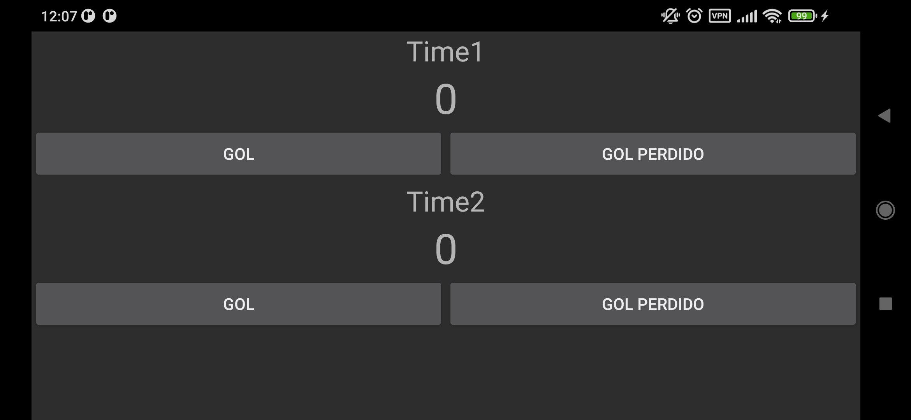

# Placar de Futebol

Aplicação feita como atividade da disciplina de Programação Para Dispositivos Móveis. Funciona como um placar de Futebol.

## Índice

- [Placar de Futebol](#placar-de-futebol)
  - [Sobre](#sobre)
  - [Tela Inicial](#tela-inicial)
    - [Configurar Partida](#configurar-partida)
  - [Histórico de Partidas](#histórico-de-partidas)
  - [Placar](#placar)
  - [Pênaltis](#pênaltis)
  - [Feito por](#feito-por)

## Sobre

O projeto é uma aplicação android feita com Kotlin e Android Studio. O objetivo é criar um placar de futebol, onde o usuário pode adicionar os times que estão jogando, adicionar os gols de cada time e ver o resultado final. Além disso, o usuário pode ver a prorrogação e os pênaltis, caso o jogo tenha ido para essas fases.

## Tela Inicial

A tela inicial possui dois botões, um para configurar uma partida e outro para ver o histórico de partidas.

    

### Configurar Partida

Ao clicar no botão de configurar partida, o usuário é levado para uma tela onde pode adicionar os times que estão jogando. Os minutos que essa partida irá durar e se ela terá prorrogação e pênaltis.

    

Além disso, o aplicativo salva a última configuração feita, para que o usuário não precise configurar toda vez que for jogar.

    

Para iniciar a partida, é preciso que tempo de duração esteja preenchido e que os nomes dos dois times estejam preenchidos. Ademais, a função de pênalti só pode ser realizada se a partida possuir prorrogação. Caso contrário, o aplicativo não deixa o usuário iniciar a partida e mostra avisos na tela.

|  |  |
|:---:|:---:|
| Aviso de Configuração | Aviso de Pênalti sem Prorrogação |

## Histórico de Partidas

As partidas que foram jogadas ficam salvas no histórico. O usuário pode ver o resultado final de cada partida, como gols e o nome dos times.

|  |  |
|:---:|:---:|
| Histórico Vazio | Histórico com Partidas |

## Placar

O placar possui os nomes dos times, os gols de cada time e o tempo de partida. Além disso, o usuário pode adicionar gols para cada time. Quando acréscimos começam (meio do tempo e final do tempo) o celular vibra para avisar. O fim dos acréscimos é determinado pelo usuário.

|  | 
|:---:|:---:|
| Primeiro Tempo | Segundo Tempo |

No fim da partida, caso não tenha pênaltis, a tela com o resultado final e de confirmação de fim de partida aparece.

## Pênaltis

Caso a partida tenha ido para os pênaltis, o usuário pode adicionar os gols de cada time. O aplicativo mostra o resultado final e de confirmação de fim de partida.

|  |  |
|:---:|:---:|

## Feito por

- [Levi Ferreira](https://github.com/levifmorais)
- [Marcio Jr.](https://github.com/MarcioJnr)
